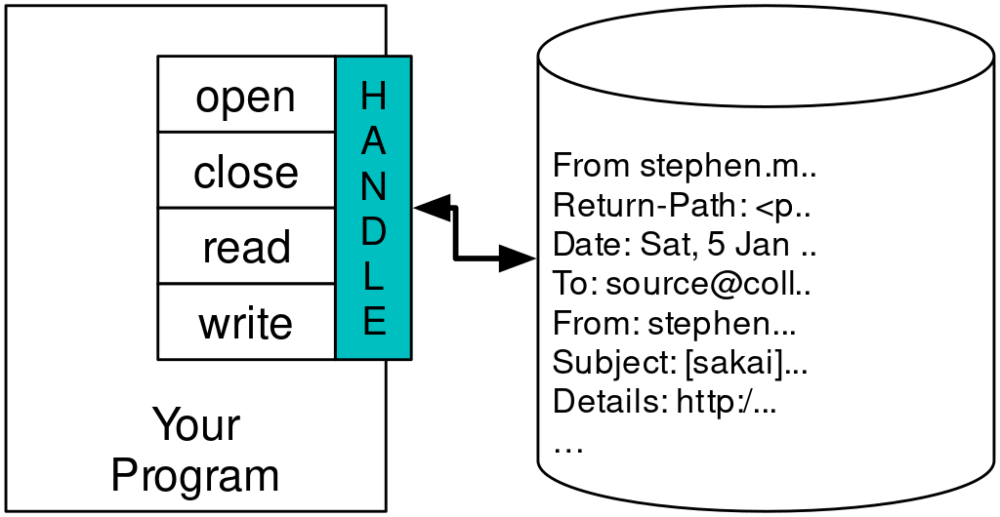

# Lesson 7: Files

- [Lesson 7: Files](#lesson-7-files)
  - [Persistence](#persistence)
    - [https://www.youtube.com/watch?v=9KJ-XeQ6ZlI](#httpswwwyoutubecomwatchv9kj-xeq6zli)
  - [Opening Files](#opening-files)
  - [Text Files and Lines](#text-files-and-lines)
  - [Reading Files](#reading-files)
    - [https://www.youtube.com/watch?v=0t4rvnySKR4](#httpswwwyoutubecomwatchv0t4rvnyskr4)
  - [Searching Through a File](#searching-through-a-file)
  - [Letting the User Choose the File Name](#letting-the-user-choose-the-file-name)
  - [Using `try`, `except` and `open`](#using-try-except-and-open)
  - [Writing Files](#writing-files)
  - [Debugging](#debugging)
  - [Glossary](#glossary)
  - [Exercises](#exercises)
    - [Exercise 1](#exercise-1)
    - [https://www.youtube.com/watch?v=MHZ4KnFZ7Y0](#httpswwwyoutubecomwatchvmhz4knfz7y0)
    - [\[Graded Assignment\] Exercise 2](#graded-assignment-exercise-2)
    - [Exercise 3](#exercise-3)


We learn how to open data files on your computer and read through the files using Python.

## Persistence

So far, we have learned how to write programs and communicate our intentions to the *Central Processing Unit* using conditional execution, functions, and iterations. We have learned to create and use data structures in the *Main Memory*. The CPU and memory are where our software works and runs. It is where all of the "thinking" happens.

But if you recall from our hardware architecture discussions, once the power is turned off, anything stored in either the CPU or Main Memory is erased. So up to now, our programs have just been transient fun exercises to learn Python. 


Secondary Memory

In this chapter, we start to work with *Secondary Memory* (or files). Secondary memory is not erased when the power is turned off. Or in the case of a USB flash drive, the data we write from our programs can be removed from the system and transported to another system.

Video: Reading Files - Part 1

### <https://www.youtube.com/watch?v=9KJ-XeQ6ZlI>

## Opening Files

When we want to read or write a file (say on your hard drive), we first must open the file. Opening the file communicates with your operating system, which knows where the data for each file is stored. When you open a file, you are asking the operating system to find the file by name and make sure the file exists. In this ecample, we open the file *mbox.txt*, which should be stored in the same folder that you are in when you start Python. You can download this file from <http://www.py4e.com/code3/mbox.txt>

```py
>>> fhand = open('mbox.txt')
>>> print(fhand)
<_io.TextIOWrapper name='mbox.txt' mode='r' encoding='cp1252'>
```

If the `open` is successful, the operating system returns us a *file handle*. The file handle is not the actual data contained in the file, but instead it is a "handle" that we can use to read the data. You are given a handle if the requested file exists and you have the proper permissions to read the file.


A File Handle

If the file does not exist, `open` will fail with a traceback and you will not get a handle to access the contents of the file: 

```py
>>> fhand = open('stuff.txt')
Traceback (most recent call last):
  File "<stdin>", line 1, in <module>
FileNotFoundError: [Errno 2] No such file or directory: 'stuff.txt'
```

Later we will use `try` and `except` to deal more gracefully with the situation where we attempt to open a file that does not exist.

## Text Files and Lines 

A text file can be thought of as a sequence of lines, much like a Python string can be thought of as a sequence of characters. For example, this is a sample of a text file which records mail activity from various individuals in an open source project development team: 

```py
From stephen.marquard@uct.ac.za Sat Jan  5 09:14:16 2008
Return-Path: <postmaster@collab.sakaiproject.org>
Date: Sat, 5 Jan 2008 09:12:18 -0500
To: source@collab.sakaiproject.org
From: stephen.marquard@uct.ac.za
Subject: [sakai] svn commit: r39772 - content/branches/
Details: http://source.sakaiproject.org/viewsvn/?view=rev&rev=39772
...
```

The entire file of mail interactions is available from <http://www.py4e.com/code3/mbox.txt> and a shorted version of the file is available from <http://www.py4e.com/code3/mbox-short.txt>

These files are in a standard format for a file containing multiple mail messages. The lines which start with "From " separate the messages and the lines which start with "From:" are part of the messages. For more information about the mbox format, see <https://en.wikipedia.org/wiki/Mbox>.


To break the file into lines, there is a special character that represents the "end of the line" called the *newline* character.

In Python, we represent the *newline* character as a backslash-n in string constants. Even though this looks like two characters, it is actually a single character. When we look at the variable by entering "stuff" in the interpreter, it shows us the \n in the string, but when we use print to show the string, we see the string broken into two lines by the newline character.

```py
>>> stuff = "Hello\nWorld!"
>>> stuff
'Hello\nWorld!'
>>> print(stuff)
Hello
World!
>>> stuff = 'X\nY'
>>> print(stuff)
X
Y
>>> len(stuff)
3
```

You can also see that the length of the string `X\nY` is three characters because the newline character is a single character.

So when we look at the lines in a file, we need to *imagine* that there is a special invisible character called the *newline* at the end of each line that marks the end of the line.

So the newline character separates the characters in the file into lines.

## Reading Files 

Video: Reading Files - Part 2 

### <https://www.youtube.com/watch?v=0t4rvnySKR4>

While the *file handle* does not contain the data for the file, it is quite easy to construct a `for` loop to read through and count each of the lines in a file:

```py
fhand = open('mbox-short.txt')
count = 0
for line in fhand:
    count = count + 1
print('Line Count:', count)
Line Count: 1910
```

We can use the file handle as the sequence in our `for` loop. Our `for` loop simply counts the number of lines in the file and prints them out. The rough translation of the `for` loop into English is, "for each line in the file represented by the file handle, add one to the `count` variable."

The reason that the `open` function does not read the entire file is that the file might be quite large with many gigabytes of data. The `open` statement takes the same amount of time regardless of the size of the file. The `for` loop actually causes the data to be read from the file. 

When the file is read using a `for` loop in this manner, Python takes care of splitting the data in the file into separate lines using the newline character. Python reads each line through the newline and includes the newline as the last character in the `line` variable for each iteration of the `for` loop.

Because the `for` loop reads the data one line at a time, it can efficiently read and count the lines in very large files without running out of main memory to store the data. The above program can count the lines in any size file using very little memory since each line is read, counted, and then discarded.

If you know the file is relatively small compared to the size of your main memory, you can read the whole file into one string using the `read` method on the file handle.

```py
>>> fhand = open('mbox-short.txt')
>>> inp = fhand.read()
>>> print(len(inp))
94626
>>> print(inp[:20]
... print(inp[:20]
  File "<stdin>", line 1
    print(inp[:20]
          ^^^^^^^
SyntaxError: invalid syntax. Perhaps you forgot a comma?
>>> print(inp[:20])
From stephen.marquar
```

In this example, the entire contents (all 94,626 characters) of the file *mbox-short.txt* are read directly into the variable `inp`. We use *string slicing* to print out the first 20 characters of the string data stored in `inp`.

When the file is read in this manner, all the characters including all of the lines and newline characters are one big string in the variable `inp`. It is a good idea to store the output of read as a variable because each call to read exhausts the resource:

```py
>>> fhand = open('mbox-short.txt')
>>> print(len(fhand.read()))
94626
>>> print(len(fhand.read()))
0
```

Remember that this form of the `open` function should only be used if the file data will fit comfortably in the main memory of your computer. If the file is too large to fit in main memory, you should write your program to read the file in chunks using a `for` or `while` loop.

## Searching Through a File

When you are searching through data in a file, it is a very common pattern to read through a file, ignoring most of the lines and only processing lines which meet a particular condition. We can combine the pattern for reading a file with string methods to build simple search mechanisms.

For example, if we wanted to read a file and only print out lines which started with the prefix "From:", we could use the string method `startswith` to select only those lines with the desired prefix:

```py
fhand = open('mbox-short.txt')
for line in fhand:
    if line.startswith('From:'):
        print(line)
```

When this program runs, we get the following output:

```py
From: stephen.marquard@uct.ac.za

From: louis@media.berkeley.edu

From: zqian@umich.edu

From: rjlowe@iupui.edu
...
```

The output looks great since the only lines we are seeing are those which start with "From:", but why are we seeing the extra blank lines? This is due to that invisible *newline* character. Each of the lines ends with a newline, so the `print` statement prints the string in the variable *line* which includes a newline and then `print` adds another newline, resulting in the double spacing effect we see.

We could use line slicing to print all but the last character, but a simpler approach is to use the `rstrip` method which strips white-spaces from the right side of a string as follows:

```py
fhand = open('mbox-short.txt')
for line in fhand:
    line = line.rstrip()
    if line.startswith('From:'):
        print(line)
```

When this program runs, we get the following output:

```py
From: stephen.marquard@uct.ac.za
From: louis@media.berkeley.edu
From: zqian@umich.edu
From: rjlowe@iupui.edu
From: zqian@umich.edu
From: rjlowe@iupui.edu
From: cwen@iupui.edu
...
```

As your file processing programs get more complicated, you may want to structure your search loops using `continue`. The basic idea of the search loop is that you are looking for "*interesting*" lines and effectively skipping "*uninteresting*" lines. And then when we find an interesting line, we do something with that line.

We can structure the loop to follow the pattern of skipping uninteresting lines as follows:

```py
fhand = open('mbox-short.txt')
for line in fhand:
    line = line.rstrip()
    # Skip 'uninteresting lines'
    if not line.startswith('From:'):
        continue
    # Process our 'interesting' line
    print(line)
```

The output of the program is the same. In English, the uninteresting lines are those which do not start with "From:", which we skip using `continue`. For the "interesting" lines (i.e., those that start with "From:") we perform the processing.

We can use the `find` string method to simulate a text editor search that finds lines where the search string is anywhere in the line. Since `find` looks for an occurrence of a string within another string and either returns the position of the string or -1 if the string was not found, we can write the following loop to show lines which contain the string "`@uct.ac.za`" (i.e., they come from the University of Cape Town in South Africa):

```py
fhand = open('mbox-short.txt')
for line in fhand:
    line = line.rstrip()
    if line.find('@uct.ac.za') == -1: continue
    print(line)
```

Which produces the following output:

```py
From stephen.marquard@uct.ac.za Sat Jan  5 09:14:16 2008
X-Authentication-Warning: set sender to stephen.marquard@uct.ac.za using -f
From: stephen.marquard@uct.ac.za
Author: stephen.marquard@uct.ac.za
From david.horwitz@uct.ac.za Fri Jan  4 07:02:32 2008
X-Authentication-Warning: set sender to david.horwitz@uct.ac.za using -f
From: david.horwitz@uct.ac.za
Author: david.horwitz@uct.ac.za
...
```

Here we also use the contracted form of the `if` statement where we put the continue on the same line as the `if`. This contracted form of the `if` functions the same as if the `continue` were on the next line and indented.

## Letting the User Choose the File Name

We really do not want to have to edit our Python code every time we want to process a different file. It would be more usable to ask the user to enter the file name string each time the program runs so they can use our program on different files without changing the Python code.

This is quite simple to do by reading the file name from the user using `input` as follows:

```py
fname = input('Enter the file name: ')
fhand = open(fname)
count = 0
for line in fhand:
    if line.startswith('Subject:'):
        count = count + 1
print('There were', count, 'subject lines in', fname)
```

We read the file name from the user and place it in a variable named `fname` and open that file. Now we can run the program repeatedly on different files.

```py
python search6.py
Enter the file name: mbox.txt
There were 1797 subject lines in mbox.txt

python search6.py
Enter the file name: mbox-short.txt
There were 27 subject lines in mbox-short.txt
```

Before peeking at the next section, take a look at the above program and ask yourself, "What could go possibly wrong here?" or "What might our friendly user do that would cause our nice little program to ungracefully exit with a traceback, making us look not-so-cool in the eyes of our users?"

## Using `try`, `except` and `open`

I told you not to peek. This is your last chance.

What if our user types something that is not a file name?

```py
python search6.py
Enter the file name: missing.txt
Traceback (most recent call last):
  File "search6.py", line 2, in <module>
    fhand = open(fname)
FileNotFoundError: [Errno 2] No such file or directory: 'missing.txt'

python search6.py
Enter the file name: na na boo boo
Traceback (most recent call last):
  File "search6.py", line 2, in <module>
    fhand = open(fname)
FileNotFoundError: [Errno 2] No such file or directory: 'na na boo boo'
```

Do not laugh. Users will eventually do every possible thing they can do to break your programs, either mistakenly or with malicious intent. As a matter of fact, an important part of any software development team is a person or group called *Quality Assurance* (or *QA* for short) whose very job it is to do the craziest things possible in an attempt to break the software that the programmer has created.

The QA team is responsible for finding the flaws in programs before we have delivered the program to the end users who may be purchasing the software or paying our salary to write the software. So the QA team is the programmer's best friend.

So now that we see the flaw in the program, we can elegantly fix it using the `try`/`except` structure. We need to assume that the open call might fail and add recovery code when the open fails as follows:

```py
fname = input('Enter the file name: ')
try:
    fhand = open(fname)
except:
    print('File cannot be opened:', fname)
    exit()
count = 0
for line in fhand:
    if line.startswith('Subject:'):
        count = count + 1
print('There were', count, 'subject lines in', fname)

```

The `exit` function terminates the program. It is a function that we call that never returns. Now when our user (or QA team) types in silliness or bad file names, we "catch" them and recover gracefully:

```py
python search7.py
Enter the file name: mbox.txt
There were 1797 subject lines in mbox.txt

python search7.py
Enter the file name: na na boo boo
File cannot be opened: na na boo boo
```

Protecting the `open` call is a good example of the proper use of `try` and `except` in a Python program. We use the term "Pythonic" when we are doing something the "Python way". We might say that the above example is the Pythonic way to open a file.

Once you become more skilled in Python, you can engage in repartee with other Python programmers to decide which of two equivalent solutions to a problem is "more Pythonic". The goal to be "more Pythonic" captures the notion that programming is part engineering and part art. We are not always interested in just making something work, we also want our solution to be elegant and to be appreciated as elegant by our peers.

## Writing Files

To write a file, you have to open it with mode "w" as a second parameter:

```py
>>> fout = open('output.txt', 'w')
>>> print(fout)
<_io.TextIOWrapper name='output.txt' mode='w' encoding='cp1252'>
```

If the file already exists, opening it in write mode clears out the old data and starts fresh, so be careful! If the file doesn't exist, a new one is created.

The write method of the file handle object puts data into the file, returning the number of characters written. The default write mode is text for writing (and reading) strings.

```py
>>> line1 = "This here's the wattle,\n"
>>> fout.write(line1)
24
```

Again, the file object keeps track of where it is, so if you call `write` again, it adds the new data to the end.

We must make sure to manage the ends of lines as we write to the file by explicitly inserting the newline character when we want to end a line. The print statement automatically appends a newline, but the write method does not add the newline automatically.

```py
>>> line2 = 'the emblem of our land.\n'
>>> fout.write(line2)
24
```

When you are done writing, you have to close the file to make sure that the last bit of data is physically written to the disk so it will not be lost if the power goes off.

```py
>>> fout.close()
```

We could close the files which we open for read as well, but we can be a little sloppy if we are only opening a few files since Python makes sure that all open files are closed when the program ends. When we are writing files, we want to explicitly close the files so as to leave nothing to chance.

## Debugging

When you are reading and writing files, you might run into problems with whitespace. These errors can be hard to debug because spaces, tabs, and newlines are normally invisible:

```py
>>> s = '1 2\t 3\n 4'
>>> print(s)
1 2  3
 4
```

The built-in function `repr` can help. It takes any object as an argument and returns a string representation of the object. For strings, it represents whitespace characters with backslash sequences:

```py
>>> print(repr(s))
'1 2\t 3\n 4'
```

This can be helpful for debugging.

One other problem you might run into is that different systems use different characters to indicate the end of a line. Some systems use a newline, represented \n. Others use a return character, represented \r. Some use both. If you move files between different systems, these inconsistencies might cause problems.

For most systems, there are applications to convert from one format to another. You can find them (and read more about this issue) at <https://www.wikipedia.org/wiki/Newline>. Or, of course, you could write one yourself.

## Glossary

**catch**: To prevent an exception from terminating a program using the try and except statements.

**newline**: A special character used in files and strings to indicate the end of a line.

**Pythonic**: A technique that works elegantly in Python. "Using try and except is the Pythonic way to recover from missing files".

**Quality Assurance**: A person or team focused on insuring the overall quality of a software product. QA is often involved in testing a product and identifying problems before the product is released.

**text file**: A sequence of characters stored in permanent storage like a hard drive.

## Exercises

### Exercise 1

Write a program to read through a file and print the contents of the file (line by line) all in upper case. Executing the program will look as follows:

```py
python shout.py
Enter a file name: mbox-short.txt
FROM STEPHEN.MARQUARD@UCT.AC.ZA SAT JAN  5 09:14:16 2008
RETURN-PATH: <POSTMASTER@COLLAB.SAKAIPROJECT.ORG>
RECEIVED: FROM MURDER (MAIL.UMICH.EDU [141.211.14.90])
     BY FRANKENSTEIN.MAIL.UMICH.EDU (CYRUS V2.3.8) WITH LMTPA;
     SAT, 05 JAN 2008 09:14:16 -0500
```

You can download the file from <http://www.py4e.com/code3/mbox-short.txt>

Video: Worked Exercise 7.1

### <https://www.youtube.com/watch?v=MHZ4KnFZ7Y0>

```py
fh = open('mbox-short.txt')
# print(fh)

for lx in fh:
    ly = lx.rstrip() # use `rstrip()` to remove \n at end of line
    print(ly.upper()) # use `upper()` to shout file 
```

Produces the output:

```py
... ALL FILE LINES ARE NOW ALL CAPS ...
```

### [Graded Assignment] Exercise 2

Accept and complete the assignment in the Github Classroom.Write a program to prompt for a file name, and then read through the file and look for lines of the form:

```py
X-DSPAM-Confidence: 0.8475
```

When you encounter a line that starts with "X-DSPAM-Confidence:" pull apart the line to extract the floating-point number on the line. Count these lines and then compute the total of the spam confidence values from these lines. When you reach the end of the file, print out the average spam confidence.

```py
Enter the file name: mbox.txt
Average spam confidence: 0.894128046745

Enter the file name: mbox-short.txt
Average spam confidence: 0.750718518519
```

Test your file on the mbox.txt and mbox-short.txt files.

```py
def exercise_7_2():
    # Use the file name mbox-short.txt as the file name
    fname = input("Enter file name: ")
    # first, be pythonic with error message
    try:
        fh = open(fname) 
    except: 
        print('File cannot be opened:', fname)
        exit()
    # next, set counters and iterate through for loop 
    count = 0
    spam = 0.0 
    for line in fh:
        if not line.startswith("X-DSPAM-Confidence:"):
            continue
        count = count + 1
        spam = spam + float(line[-7:].rstrip()) # float `line` and remove whitespace
        avg_spam = spam/count      
    print('Average spam confidence:', avg_spam)
exercise_7_2()
```

Produces the result:

```py
Enter file name: mbox-short.txt 
Average spam confidence: 0.7507185185185187
```

### Exercise 3

Sometimes when programmers get bored or want to have a bit of fun, they add a harmless Easter Egg to their program. Modify the program that prompts the user for the file name so that it prints a funny message when the user types in the exact file name "na na boo boo". The program should behave normally for all other files which exist and don't exist. Here is a sample execution of the program:

```py
python egg.py
Enter the file name: mbox.txt
There were 1797 subject lines in mbox.txt

python egg.py
Enter the file name: missing.tyxt
File cannot be opened: missing.tyxt

python egg.py
Enter the file name: na na boo boo
NA NA BOO BOO TO YOU - You have been punk'd!
```

We are not encouraging you to put Easter Eggs in your programs; this is just an exercise.

```py
fname = input('Enter the file name: ')
if fname == "na na boo boo":
        print("NA NA BOO BOO TO YOU TO - You have been punk'd!")
        exit()
try:
    fh = open(fname)
except:
    print('File cannot be opened', fname)
    exit()
count = 0
for line in fh:
    if line.startswith("Subject:"):
        count += 1 
print("There were", count, "subject lines in", fname)
```

```py
Enter the file name: na na boo boo
NA NA BOO BOO TO YOU TO - You have been punk'd!
```
