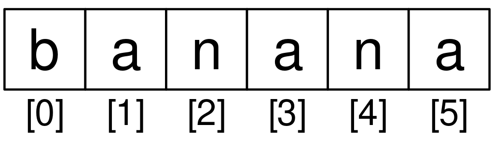

# Lesson 6: Strings

We look at how Python stores and manipulates textual data using string variables and functions.

- [Lesson 6: Strings](#lesson-6-strings)
  - [A String is a Sequence](#a-string-is-a-sequence)
    - [https://www.youtube.com/watch?v=dr98iM4app8](#httpswwwyoutubecomwatchvdr98im4app8)
  - [Getting the Length of a String using `len`](#getting-the-length-of-a-string-using-len)
  - [Traversal through a String with a Loop](#traversal-through-a-string-with-a-loop)
    - [Exercise 1](#exercise-1)
  - [String Slices](#string-slices)
    - [https://www.youtube.com/watch?v=bIFpJ-qZ3Cc](#httpswwwyoutubecomwatchvbifpj-qz3cc)
    - [Exercise 2](#exercise-2)
  - [Strings are Immutable](#strings-are-immutable)
  - [Looping and Counting](#looping-and-counting)
    - [Exercise 3](#exercise-3)
  - [The `in` Operator](#the-in-operator)
  - [String Comparison](#string-comparison)
  - [String Methods](#string-methods)
    - [Exercise 4](#exercise-4)
  - [Parsing Strings](#parsing-strings)
  - [Format Operator](#format-operator)
  - [Debugging](#debugging)
  - [Glossary](#glossary)
  - [\[Graded Assignment\] Exercise 5](#graded-assignment-exercise-5)
    - [https://www.youtube.com/watch?v=BGTxwsDI9KY](#httpswwwyoutubecomwatchvbgtxwsdi9ky)
  - [Exercise 6](#exercise-6)


## A String is a Sequence

Video: Strings - Part 1

### <https://www.youtube.com/watch?v=dr98iM4app8>

A string is a *sequence* of characters. You can access the characters one at a time with the bracket operator.


```py
fruit = 'banana'
letter = fruit[1]
```

The expression in brackets is called an *index*. The index indicates which character in the sequence you want (hence the name).

But you might not get what you expect:

```py
>>> print(letter)
a
```

For most people, the first letter of "banana" is "b", not "a". But in Python, the index is an offset from the beginning of the string, and the offset of the first letter is zero.

```py
>>> letter = fruit[0]
>>> print(letter)
b
```

So "b" is the 0th letter ("zero-th") of banana, "a" is the 1th letter ("one-th"), and "n" is the 2th ("two-th") letter. 


String Indexes 

You can use any expression, including variables and operators, as an index, but the value of the index has to be an integer. Otherwise you get:

```py
>>> letter = fruit[1.5]
TypeError: string indices must be integers
```

## Getting the Length of a String using `len`

`len` is a built-in function that returns the number of characters in a string: 

```py
>>> fruit = 'banana'
>>> len(fruit)
6
```

To get the last letter of a string, you might be tempted to try something like this: 

```py
>>> length = len(fruit)
>>> last = fruit[length]
IndexError: string index out of range
```

The reason for the `IndexError` is that there is no letter in 'banana' with the index of 6. Since we started counting at zero, the six letters are numbers 0 to 5. To get the last character, you have to subtract 1 from `length`: 

```py
>>> last = fruit[length-1]
>>> print(last)
a
```

Alternatively, you can use negative indices, which count backward from the end of the string. The expression `fruit[-1]` yields the last letter, `fruit[-2]` yields the second to last, and so on.

## Traversal through a String with a Loop 

A lot of computations involve processing a string one character at a time. Often they start at the beginning, select each character in turn, do something to it, and continue until the end. This pattern of processing is called a *traversal*. One way to wrtie a traversal is with a `while` loop:

```py
>>> index = 0 
>>> while index < len(fruit):
        letter = fruit[index]
        print(letter)
        index = index + 1 
```

This loop traverses the string and displays each letter on a line by itself. The loop condition is `index < len(fruit)`, so when `index` is equal to the length of the string, the condition is false, and the body of the loop is not executed. The last character accessed is the one with the index `len(fruit)-1`, which is the last character in the string.

### Exercise 1 

Write a `while` loop that starts at the last character in the string and works its way backwards to the first character in the string, printing each letter on a separate line, except backwards. 

Another way to write a traversal is with a `for` loop:

```py
for char in fruit:
    print(char)
```

Each time through the loop, the next character in the string is assigned to the variable `char`. The loop continues until no characters are left. 

## String Slices

Video: Strings - Part 2

### <https://www.youtube.com/watch?v=bIFpJ-qZ3Cc>

A segment of a string is called a *slice*. Selecting a slice is similiar to selecting a character:

```py
>>> s = "Monty Python"
>>> print(s[0:5])
Monty
>>> print(s[6:12])
Python
```

The operator [n:m] returns the part of the string from the "n-th" character to the "m-th" character, including the first but excluding the last.

If you omit the first index (before the colon), the slice starts at the beginning of the string. If you omit the second index, the slice goes to the end of the string. 

```py
>>> fruit = 'banana'
>>> fruit[:3]
'ban'
>>> fruit[3:]
'ana'
```

If the first index is greater than or equal to the second the result is an *empty string*, represented by two quotation marks: 

```py
>>> fruit = 'banana'
>>> fruit[3:3]
''
```

An empty string contains no characters and has length 0, but other that that, it is the same as any other string. 

### Exercise 2

Given that `fruit` is a string, what does `fruit[:]` mean? 

- This will start from the beginning and go all the way to the end of the string.

## Strings are Immutable

It is tempting to use the operator on the left side of an assignment, with the intention of changing a character in a string. For example: 

```py
>>> greeting = "Hello world!"
>>> greeting[0] = 'J'
TypeError: 'str' object does not support item assignment
```

The 'object' in this case is the string and the 'item' is the character you tried to assign. For now, and *object* is the same thing as a value, but we will refine that definition later. An *item* is one of the values in a sequence. 

The reason for the error is that strings are *immutable*, which means you can't change an existing string. The best you can do is create a new string that is a variation on the original. 

```py
>>> greeting = 'Hello, world!'
>>> new_greeting = 'J' + greeting[1:]
>>> print(new_greeting)
Jello, world!
```

This example concatenates a new first letter onto a slice of `greeting`. It has no effect on the original string. 

## Looping and Counting

The following program counts the number of times the letter 'a' appears in a string:

```py
word = 'banana'
count = 0
for letter in word:
    if letter == 'a':
        count = count + 1 
print(count)
```

This program demonstrates another pattern of computation called a *counter*. The variable `count` is initialized to 0 and then incremented each time an 'a' is found. When the loop exits, `count` contains the result: the total number of a's.

### Exercise 3

Encapsulate this code in a function named `count`, and generalize it so that it accepts the string and the letter arguments.

```py
>>> def countLetters(zap, zing): 
    count = 0
    for letter in zap:
        if letter == zing:
            count += 1  
    print(count)
        
>>> countLetters('mississippi', 's')
4
```

## The `in` Operator

The word `in` is a boolean operator that makes two strings and returns `True` if the first appears as a substring in the second. 

```py
>>> 'a' in 'banana'
True
>>> 'seed' in 'banana'
False
```

## String Comparison

The comparison operators work on strings. To see if two strings are equal:

```py
if word == 'banana':
    print('All right, bananas.')
```

Other comparison operations are useful for putting words in alphabetical order: 

```py
if word < 'banana':
    print('Your word,' + word + ', comes before banana.')
elif word > 'banana':
    print('Your word,' + word + ', comes after banana.')
else:
    print('All right, bananas.')
```

Python does not handle uppercase and lowercase letters the same way that people do. All the uppercase letters come before all the lowercase letters, so:

```py
Your word, Pineapple, comes before banana.
```

A common way to address this problem is to convert strings to a standard format, such as all lowercase, before performing the comparison. Keep that in mind in case you have to defend yourself against a man armed with a Pineapple.

## String Methods

Strings are an example of Python *objects*. An object contains both data (the actual string itself) and *methods*, which are effectively functions that are built into the object and are available to any *instance* of the object. 

Python has a function called `dir` which lists the methods available for an object. The `type` function shows the type of an object and the `dir` function shows the available methods.

```py
>>> stuff = 'Hello world'
>>> type(stuff)
<class 'str'>
>>> dir(stuff)
['capitalize', 'casefold', 'center', 'count', 'encode',
'endswith', 'expandtabs', 'find', 'format', 'format_map',
'index', 'isalnum', 'isalpha', 'isdecimal', 'isdigit',
'isidentifier', 'islower', 'isnumeric', 'isprintable',
'isspace', 'istitle', 'isupper', 'join', 'ljust', 'lower',
'lstrip', 'maketrans', 'partition', 'replace', 'rfind',
'rindex', 'rjust', 'rpartition', 'rsplit', 'rstrip',
'split', 'splitlines', 'startswith', 'strip', 'swapcase',
'title', 'translate', 'upper', 'zfill']
>>> help(str.capitalize)
Help on method_descriptor:

capitalize(...)
    S.capitalize() -> str

    Return a capitalized version of S, i.e. make the first character
    have upper case and the rest lower case.
>>>
```

While the `dir` function lists the methods, and you can use `help` to get some simple documentation on a method, a better source of documentation for string methods would be <https://docs.python.org/library/stdtypes.html#string-methods>

Calling a *method* is similar to calling a function (it takes arguments and returns a value) but the syntax is different. We call a method by appending the method name to the variable name using the period as a delimiter.

For example, the method `upper` takes a string and returns a new string with all uppercase letters:

Instead of the function syntax `upper(word)`, it uses the method syntax `word.upper()`

```py
>>> word = 'banana'
>>> new_word = word.upper()
>>> print(new_word)
BANANA
```

This form of dot notation specifies the name of the method, `upper`, and the name of the string to apply the method to, `word`. The empty parentheses indicate that this method takes no argument. 

A metho call is called an *invocation*, in this case, we would say that we are invoking `upper` on the `word`. 

For example, there is a string method named `find` that searches for the position of one string within another. 

```py
>>> word = 'banana'
>>> index = word.find('a')
>>> print(index)
1
```

In this example, we invoke `find` on `word` and pass the letter we are looking for as a parameter.

The `find` method can find substrings as well as characters. 

```py
>>> word.find('na')
2
```

It can take as a second argument the index where it should start:

```py
>>> word.find('na', 3)
4
```

One common task is to remove white space (spaces, tabs, or newlines) from the beginning and end of a string using the `strip` method:

```py
>>> line = '  Here we go  '
>>> line.strip()
'Here we go'
```

Some methods such as startswith() return boolean values. 

```py
>>> line = 'Have a nice day'
>>> line.startswith('Have')
True
>>> line.startswith('h')
False
```

You will note that `startswith` requires case to match, so sometimes we take a line and map it all to lowercase before we do any checking using the `lower` method. 

```py
>>> line = 'Have a nice day'
>>> line.startswith('h')
False
>>> line.lower()
'have a nice day'
>>> line.lower().startswith('h')
True
```

In the last example, the method `lower` is called and then we use `startswith` to see if the resulting lowercase string starts with the letter 'h'. As long as we are careful with the order, we can make multiple method calls in a single expression. 

### Exercise 4

There is a string method called `count` that is similar to the function in the previous exercise. Read the documentation of this method at:

<https://docs.python.org/library/stdtypes.html#string-methods>

Write an invocation that counts the number of times the letter a occurs in 'banana'. 

```py
word = 'banana'
print(word.count('a'))
3
```

## Parsing Strings

Often, we want to look into a string and find a substring. For example if we were presented a series of lines formatted as follows:

`From stephen.marquard@ uct.ac.za Sat Jan  5 09:14:16 2008`

and we wanted to pull out only the second half of the address (i.e., `uct.ac.za`) from each line, we can do this by using the `find` method and string slicing.

First, we will find the position of the at-sign in the string. Then we will find the position of the first space after the at-sign. And then we will use string slicing to extract the portion of the string which we are looking for.

```py
>>> data = 'From stephen.marquard@uct.ac.za Sat Jan  5 09:14:16 2008'
>>> atpos = data.find('@')
>>> print(atpos)
21
>>> sppos = data.find(' ',atpos)
>>> print(sppos)
31
>>> host = data[atpos+1:sppos]
>>> print(host)
uct.ac.za
>>>
```

We use a version of the `find` method which allows us to specify a position in the string where we want `find` to start looking. When we slice, we extract the characters from "one beyond the at-sign through *up to but not including the space character*".

The documentation for the find method is available at

<https://docs.python.org/library/stdtypes.html#string-methods.>

## Format Operator

The format operator, `%` allows us to construct strings, replacing parts of the strings with the data stored in variables. When applied to integers, % is the modulus operator. But when the first operand is a string, % is the format operator.

The first operand is the *format string*, which contains one or more format sequences that specify how the second operand is formatted. The result is a string.

For example, the format sequence `%d` means that the second operand should be formatted as an integer ("d" stands for "decimal"):

```py
>>> camels = 42
>>> '%d' % camels
'42'
```

The result is the string '42', which is not to be confused with the integer value 42.

A format sequence can appear anywhere in the string, so you can embed a value in a sentence:

```py
>>> camels = 42
>>> 'I have spotted %d camels.' % camels
'I have spotted 42 camels.'
```

If there is more than one format sequence in the string, the second argument has to be a tuple^[A tuple is a sequence of comma-separated values inside a pair of parenthesis. We will cover tuples in Chapter 10]. Each format sequence is matched with an element of the tuple, in order.

The following example uses %d to format an integer, %g to format a floating-point number (don't ask why), and %s to format a string:

```py
>>> 'In %d years I have spotted %g %s.' % (3, 0.1, 'camels')
'In 3 years I have spotted 0.1 camels.'
```

The number of elements in the tuple must match the number of format sequences in the string. The types of the elements also must match the format sequences:

```py
>>> '%d %d %d' % (1,2)
TypeError: not enough arguments for format string
>>> '%d' % 'dollars'
TypeError: %d format: a number is required, not str
```

In the first example, there aren't enough elements; in the second, the element is the wrong type.

The format operator is powerful, but it can be difficult to use. You can read more about it at

<https://docs.python.org/library/stdtypes.html#printf-style-string-formatting.>

## Debugging

A skill that you should cultivate as you program is always asking youself, "What could go wrong here? or alternatively, "What crazy thing might our user do to crash our (seemingly) perfect program?"

For example, look at the program which we used to demonstrate the `while` loop in the chapter on interation:

```py
while True:
    line = input('> ')
    if line[0] == '#':
        continue
    if line == 'done':
        break
    print(line)
print('Done!')
```

Look what happens when the user enters an empty line of input:

```py
> hello there
hello there
> # don't print this
> print this!
print this!
>
Traceback (most recent call last):
  File "copytildone.py", line 3, in <module>
    if line[0] == '#':
IndexError: string index out of range
```

The code works fine until it is presented an empty line. Then there is no zero-th character, so we get a traceback. There are two solutions to this to make line three "safe" even if the line is empty.

One possibility is to simply use the `startswith` method which returns `False` if the string is empty.

```py
if line.startswith('#'):
```

Another way is to safely write the `if` statement using the *guardian* pattern and make sure the second logical expression is evaluated only where there is at least one character in the string:

```py
if len(line) > 0 and line[0] == '#':
```

## Glossary

**counter**: A variable used to count something, usually initialized to zero and then incremented.

**empty string**: A string with no characters and length 0, represented by two quotation marks.

**format operator**: An operator, %, that takes a format string and a tuple and generates a string that includes the elements of the tuple formatted as specified by the format string.

**format sequence**: A sequence of characters in a format string, like %d, that specifies how a value should be formatted.

**format string**: A string, used with the format operator, that contains format sequences.

**flag**: A boolean variable used to indicate whether a condition is true or false.

**invocation**: A statement that calls a method.

**immutable**: The property of a sequence whose items cannot be assigned.

**index**: An integer value used to select an item in a sequence, such as a character in a string.

**item**: One of the values in a sequence.

**method**: A function that is associated with an object and called using dot notation.

**object**: Something a variable can refer to. For now, you can use "object" and "value" interchangeably.

**search**: A pattern of traversal that stops when it finds what it is looking for.

**sequence**: An ordered set; that is, a set of values where each value is identified by an integer index.

**slice**: A part of a string specified by a range of indices.

**traverse**: To iterate through the items in a sequence, performing a similar operation on each.

## [Graded Assignment] Exercise 5

Accept and complete the assignment in the Github Classroom. Take the following Python code that stores a string:

`str = 'X-DSPAM-Confidence: 0.8475'`

Use `find` and string slicing to extract the portion of the string after the colon character and then use the `float` function to convert the extracted string into a floating point number.

### <https://www.youtube.com/watch?v=BGTxwsDI9KY>

```py
def exercise_6_5():
    text = "X-DSPAM-Confidence:    0.8475"
    # print(text)
    ipos = text.find(":")
    # print(ipos) 
    piece = text[ipos+1:].strip() # strip whitespace
    # print(piece)
    value = float(piece)
    print(value)

# exercise_6_5()
```

## Exercise 6

Read the documentation of the string methods at <https://docs.python.org/library/stdtypes.html#string-methods> You might want to experiment with some of them to make sure you understand how they work. strip and replace are particularly useful.

The documentation uses a syntax that might be confusing. For example, in find(sub[, start[, end]]), the brackets indicate optional arguments. So sub is required, but start is optional, and if you include start, then end is optional.
