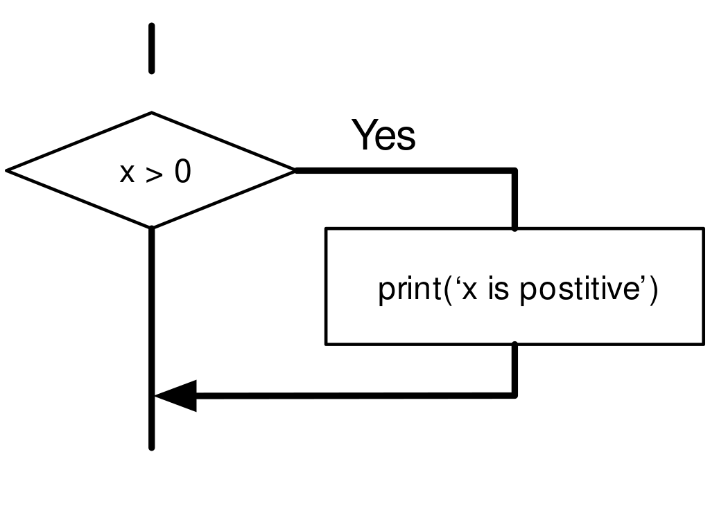
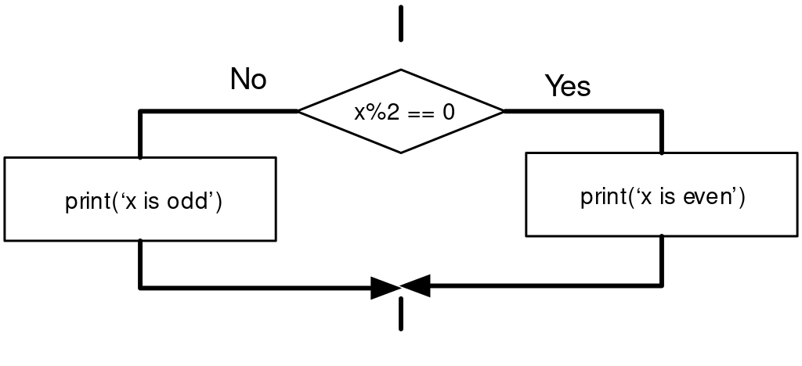
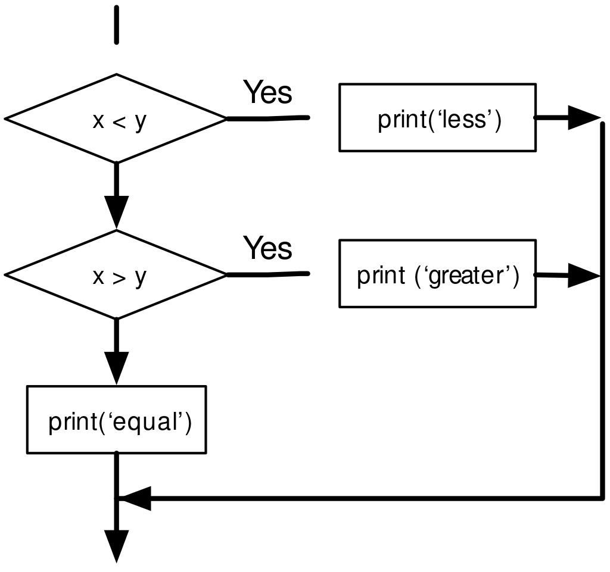
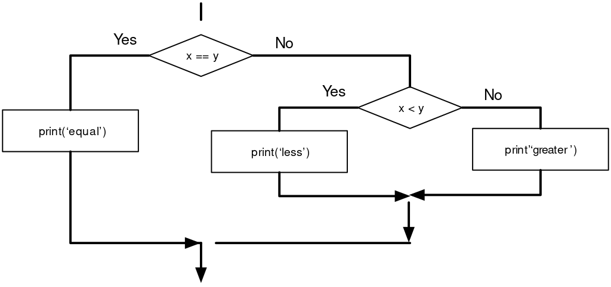

# Lesson 3: Conditionals 

We look at how Python executes some statements and skips others.

Video: Conditional Execution - Part 1

<https://www.youtube.com/watch?v=2aA3VBdcl6A>  
Copyright Creative Commons Attribution 3.0 - Charles R. Severance

## Boolean Expressions

A *boolean expression* is an expression that is either true or false. The following examples use the operator `==`, which compares two operands and produces `True` if they are equal and `False` otherwise:

``` py
>>> 5 == 5
True
>>> 5 == 6
False
```

`True` and `False` are special values that belong to the class `bool`; they are not strings:

``` py
>>> type(True)
<class 'bool'>
>>> type(False)
<class 'bool'>
```

The `==` operator is one of the *comparison operators*; the others are:

``` py
x != y               # x is not equal to y
x > y                # x is greater than y
x < y                # x is less than y
x >= y               # x is greater than or equal to y
x <= y               # x is less than or equal to y
x is y               # x is the same as y
x is not y           # x is not the same as y
```

Although these operations are probably familiar to you, the Python symbols are different from the mathematical symbols for the same operations. A common error is to use a single equal sign (`=`) instead of a double equal sign (`==`). Remember that = is an assignment operator and `==` is a comparison operator. There is no such thing as `=<` or `=>`.

## Logical Operators 

There are three logical operators: `and`, `or`, and `not`. The semantics (meaning) of these operators is similar to their meaning in English. For example,

`x > 0 and x < 10`

is true only if `x` is greater than 0 *and less* than 10.

`n%2 == 0 or n%3 == 0` is true if *either* of the conditions is true, that is, if the number is divisible by 2 or 3.

Finally, the `not` operator negates a boolean expression, so `not (x > y)` is true if `x > y` is false; that is, if `x` is less than or equal to `y`.

Strictly speaking, the operands of the logical operators should be boolean expressions, but Python is not very strict. Any nonzero number is interpreted as "true."

``` py
>>> 17 and True
True
```

This flexibility can be useful, but there are some subtleties to it that might be confusing. You might want to avoid it until you are sure you know what you are doing.

## Conditional Execution 

In order to write useful programs, we almost always need the ability to check conditions and change the behavior of the program accordingly. *Conditional statements* give us this ability. The simplest form is the `if` statement:

``` py
if x > 0 :
    print('x is positive')
```

The boolean expression after the `if` statement is called the condition. We end the `if` statement with a colon character (:) and the line(s) after the if statement are indented.


If Logic

If the logical condition is true, then the indented statement gets executed. If the logical condition is false, the indented statement is skipped.

`if` statements have the same structure as function definitions or `for` loops^[We will learn about functions in Chapter 4 and loops in Chapter 5.]. The statement consists of a header line that ends with the colon character (:) followed by an indented block. Statements like this are called *compound statements* because they stretch across more than one line.

There is no limit on the number of statements that can appear in the body, but there must be at least one. Occasionally, it is useful to have a body with no statements (usually as a place holder for code you haven't written yet). In that case, you can use the `pass` statement, which does nothing.

``` py
if x < 0 :
    pass          # need to handle negative values!
```

If you enter an `if` statement in the Python interpreter, the prompt will change from three chevrons to three dots to indicate you are in the middle of a block of statements, as shown below:

``` py
>>> x = 3
>>> if x < 10:
...    print('Small')
...
Small
>>>
```

When using the Python interpreter, you must leave a blank line at the end of a block, otherwise Python will return an error:

```py
>>> x = 3
>>> if x < 10:
...    print('Small')
... print('Done')
  File "<stdin>", line 3
    print('Done')
        ^
SyntaxError: invalid syntax
```

A blank line at the end of a block of statements is not necessary when writing and executing a script, but it may improve readability of your code.

## Alternative Execution 

A second form of the `if` statement is alternative execution, in which there are two possibilities and the condition determines which one gets executed. The syntax looks like this:

```py
if x%2 == 0 :
    print('x is even')
else :
    print('x is odd')
```

If the remainder when x is divided by 2 is 0, then we know that x is even, and the program displays a message to that effect. If the condition is false, the second set of statements is executed.


If-Then-Else Logic

Since the condition must either be true or false, exactly one of the alternatives will be executed. The alternatives are called *branches*, because they are branches in the flow of execution.

## Chained Conditionals

Video: Conditional Execution - Part 2

<https://www.youtube.com/watch?v=OczkNrHPBps>

Sometimes there are more than two possibilities and we need more than two branches. One way to express a computation like that is a *chained conditional*:

```py
if x < y:
    print('x is less than y')
elif x > y:
    print('x is greater than y')
else:
    print('x and y are equal')
```

`elif` is an abbreviation of "else if." Again, exactly one branch will be executed.


If-Then-ElseIf Logic

There is no limit on the number of `elif` statements. If there is an `else` clause, it has to be at the end, but there doesn't have to be one.

```py
if choice == 'a':
    print('Bad guess')
elif choice == 'b':
    print('Good guess')
elif choice == 'c':
    print('Close, but not correct')
```

Each condition is checked in order. If the first is false, the next is checked, and so on. If one of them is true, the corresponding branch executes, and the statement ends. Even if more than one condition is true, only the first true branch executes.

## Nested Conditionals 

One conditional can also be nested within another. We could have written the three-branch example like this:

```py
if x == y:
    print('x and y are equal')
else:
    if x < y:
        print('x is less than y')
    else:
        print('x is greater than y')
```

The outer conditional contains two branches. The first branch contains a simple statement. The second branch contains another `if` statement, which has two branches of its own. Those two branches are both simple statements, although they could have been conditional statements as well.


Nested If Statements

Although the indentation of the statements makes the structure apparent, nested *conditionals* become difficult to read very quickly. In general, it is a good idea to avoid them when you can.

Logical operators often provide a way to simplify nested conditional statements. For example, we can rewrite the following code using a single conditional:

```py 
if 0 < x:
    if x < 10:
        print('x is a positive single-digit number.')
```

The `print` statement is executed only if we make it past both conditionals, so we can get the same effect with the and operator:

```py
if 0 < x and x < 10:
    print('x is a positive single-digit number.')
```

## Catching Exceptions Using Try and Except

Earlier we saw a code segment where we used the `input` and `int` functions to read and parse an integer number entered by the user. We also saw how treacherous doing this could be:

```py
>>> prompt = "What is the air velocity of an unladen swallow?\n"
>>> speed = input(prompt)
What is the air velocity of an unladen swallow?
What do you mean, an African or a European swallow?
>>> int(speed)
ValueError: invalid literal for int() with base 10:
>>>
```

When we are executing these statements in the Python interpreter, we get a new prompt from the interpreter, think "oops", and move on to our next statement.

However if you place this code in a Python script and this error occurs, your script immediately stops in its tracks with a traceback. It does not execute the following statement.

Here is a sample program to convert a Fahrenheit temperature to a Celsius temperature:

```py
inp = input('Enter Fahrenheit Temperature: ')
fahr = float(inp)
cel = (fahr - 32.0) * 5.0 / 9.0
print(cel)
```

If we execute this code and give it invalid input, it simply fails with an unfriendly error message:

```py
python fahren.py
Enter Fahrenheit Temperature:72
22.22222222222222
```

There is a conditional execution structure built into Python to handle these types of expected and unexpected errors called "try / except". The idea of `try` and `except` is that you know that some sequence of instruction(s) may have a problem and you want to add some statements to be executed if an error occurs. These extra statements (the except block) are ignored if there is no error.

You can think of the `try` and `except` feature in Python as an "insurance policy" on a sequence of statements.

We can rewrite our temperature converter as follows:

```py
inp = input('Enter Fahrenheit Temperature:')
try:
    fahr = float(inp)
    cel = (fahr - 32.0) * 5.0 / 9.0
    print(cel)
except:
    print('Please enter a number')

```

Python starts by executing the sequence of statements in the `try` block. If all goes well, it skips the `except` block and proceeds. If an exception occurs in the try block, Python jumps out of the `try` block and executes the sequence of statements in the `except` block.

```py
python fahren2.py
Enter Fahrenheit Temperature:72
22.22222222222222
```

```py
python fahren2.py
Enter Fahrenheit Temperature:fred
Please enter a number
```

Handling an exception with a `try` statement is called *catching* an exception. In this example, the `except` clause prints an error message. In general, catching an exception gives you a chance to fix the problem, or try again, or at least end the program gracefully.

## Short-Circuit Evaluation of Logical Expressions


